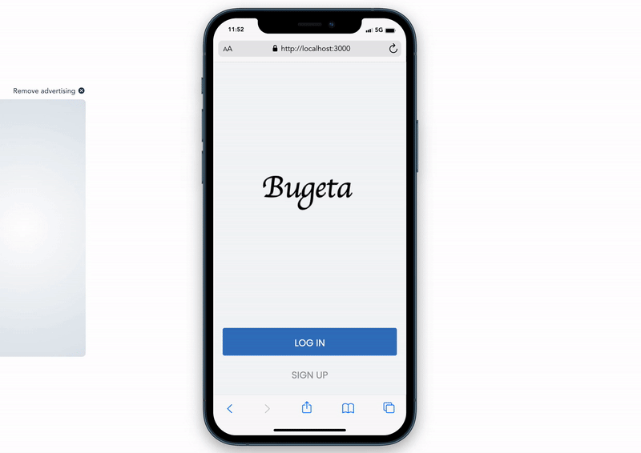

# Buget-App



## Project Description

The Budget App is a mobile-focused web application where you can manage your expenses: you have a list of expenses associated with a category, and this allows you see how much money you have spent on what and on which category. It also shows you which category you spend most on and your total expenses for the current month which helps you make more informed decisions about your finances.

- [Heroku Deploy](https://clinton-budget-app.herokuapp.com/)
- [Video Presentation](https://www.loom.com/share/e3bae155e0b44751a5ea9edf61aec272)

## Built With

- Ruby
- Ruby on Rails
- BootStrap
- Stylelint
- Rubocop
- Gems
  - Rspec
  - Capybara
  - FactoryBot
  - Selenium-webdriver
  - Bcrypt
  - Letter-opener
  - Faker
  - cancancan
  - Devise
  - Google cloud services (for image storage on production)

# Get Started
Follow these steps below:

## Pre-requisites

```bash
- Ruby
- Rails
- PostgreSQL
```

## Setup
Clone the repo and run bundle install in the command line to install the dependencies

```bash
$ git clone https://github.com/clintonjosephs/budget-app.git
$ cd budget-app
```

## Install gems with:

```bash
$ bundle install
```

## Install style linters with
```bash
$ npm install
```

## Run test on project with

```bash
$ rspec
  - this will run all the test cases
```

```bash
$ rspec spec/folder_name/name_of_test_file.rb
  - to run test cases individually
```

## Start rails server (puma)

```bash
$ rails server
```

Open [http://localhost:3000/](http://localhost:3000/) in your browser

## Author

👤 **Clinton Mbonu**

- GitHub: [@clintonjosephs](https://github.com/clintonjosephs)
- LinkedIn: [LinkedIn](https://linkedin.com/in/clinton-mbonu)
- Twitter: [@clintonmbonu2](https://twitter.com/clintonmbonu2)

## 🤝 Contributing

Contributions, issues, and feature requests are welcome!

Feel free to check the [issues page](../../issues/).

## Show your support

Give a ⭐️ if you like this project!

## Acknowledgments
Original design idea by [Snapscan - iOs design and branding](https://www.behance.net/gallery/19759151/Snapscan-iOs-design-and-branding?tracking_source=)


## 📝 License

See [PUBLIC](./LICENSE) license.